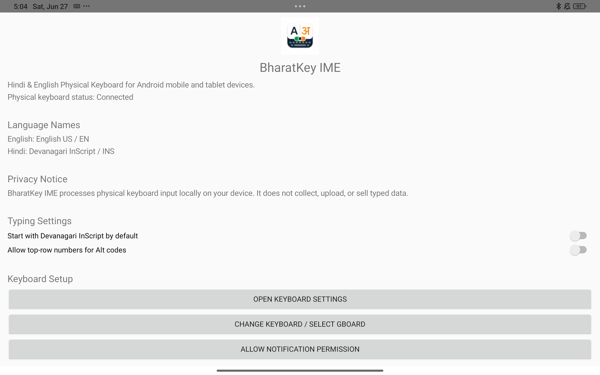
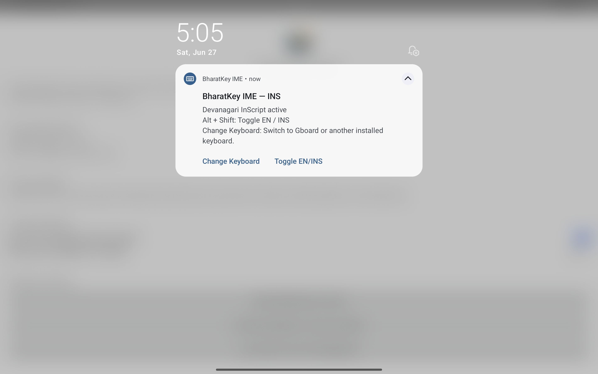

#  BharatKey IME

<p align="center">
  
</p>

<h1 align="center">BharatKey IME</h1>

<p align="center">
Modern Open-Source Android Keyboard for Indian Languages
</p>

<p align="center">


\

</p>

---

## 📖 About

**BharatKey IME** is a modern Android Input Method Editor (IME) designed for fast and accurate typing in Indian languages.

The project aims to provide:

* 🇮🇳 Hindi InScript Keyboard
* ⚡ Fast & Lightweight Typing
* 🎨 Modern Material Design
* 🌙 Dark Mode Support
* 🔓 Fully Open Source
* 🚀 High Performance
* 🔒 Privacy First
* 📱 Native Android Experience

---

# ✨ Features

* Hindi InScript Layout
* English Keyboard
* Fast Typing Engine
* Modern UI
* Low Memory Usage
* Smooth Performance
* Material Design
* Open Source
* Offline Support

---

## 📱 Screenshots

<p align="center">
  
  
</p>
---

# 📂 Project Structure

```
BharatKeyIME/

├── app/
├── docs/
├── .github/
├── README.md
├── LICENSE
├── CHANGELOG.md
└── CONTRIBUTING.md
```

---

# ⚙️ Requirements

* Android Studio Narwhal or newer
* Android SDK 35+
* Kotlin
* JDK 17

---

# 🚀 Getting Started

## Clone Repository

```bash
git clone https://github.com/YOUR_USERNAME/BharatKeyIME.git
```

Open Android Studio.

Open the project.

Sync Gradle.

Run the application.

---

# 🔨 Build APK

```
Build
↓

Generate Signed Bundle / APK

↓

APK
```

or

```
./gradlew assembleDebug
```

Release APK

```
./gradlew assembleRelease
```

---

# 📦 Package Name

```
com.irashad1707.bharatkeyime
```

---

# 📋 Roadmap

* Hindi InScript
* English Keyboard
* Marathi Support
* Bengali Support
* Tamil Support
* Telugu Support
* Kannada Support
* Malayalam Support
* Gujarati Support
* Punjabi Support
* Odia Support
* Sanskrit Support
* Emoji Search
* Voice Typing
*
* Clipboard Manager
* Material You
* AI Suggestions

---

# 🤝 Contributing

Contributions are welcome!

1. Fork the repository
2. Create a new branch

```
git checkout -b feature-name
```

3. Commit changes

```
git commit -m "Added new feature"
```

4. Push

```
git push origin feature-name
```

5. Open a Pull Request

---

# 🐞 Bug Reports

If you find a bug, please create a GitHub Issue with:

* Device Name
* Android Version
* Steps to Reproduce
* Screenshots
* Expected Result

---

# 📜 License

This project is licensed under the MIT License.

See the LICENSE file for details.

---

# 👨‍💻 Author

**Irashad**

GitHub

https://github.com/irashad1707

---

# ⭐ Support

If you like this project,

⭐ Star the repository

🍴 Fork it

📢 Share it with others

---

<p align="center">

Made with ❤️ for the Indian Open-Source Community

</p>
